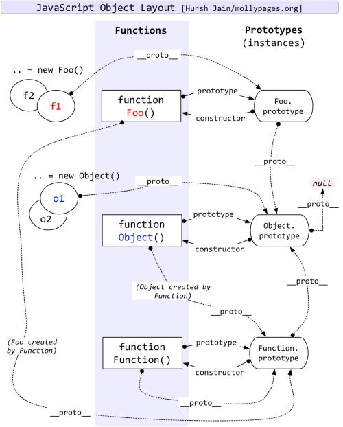

## [原文](https://www.jianshu.com/p/dee9f8b14771)

## `普通对象`和`函数对象`

```js
// JavaScript 中，万物皆对象！
var o1 = {}; 
var o2 =new Object();
var o3 = new f1();

function f1(){}; 
var f2 = function(){};
var f3 = new Function('str','console.log(str)');

// Object 、Function 是 JS 自带的函数对象。
// 凡是通过 new Function() 创建的对象都是函数对象，其他的都是普通对象。

console.log(typeof Object);     //function 
console.log(typeof Function);   //function
console.log(typeof f1);    //function 
console.log(typeof f2);    //function 
console.log(typeof f3);    //function
console.log(typeof o1); //object 
console.log(typeof o2); //object 
console.log(typeof o3); //object
```

## `构造函数`可以看作 js 的“类”。

```js
function Person(name, age, job) {
    this.name = name;
    this.age = age;
    this.job = job;
    this.sayName = function() { alert(this.name) };
};

// 通过构造函数实例化对象：
var person1 = new Person('Zaxlct', 28, 'Software Engineer');
var person2 = new Person('Mick', 23, 'Doctor');

// 每个`实例对象`都有一个 `constructor` 属性，指向`构造函数`：
console.log(person1.constructor == Person); //true
console.log(person2.constructor == Person); //true
```

## `原型对象`是`构造函数`的`第一个实例对象`，用以预定义公共属性。

```js
// 构造函数：
function Person() {};
// 预定义所有实例对象的公共属性：
Person.prototype.name = 'Zaxlct';
Person.prototype.age  = 28;
Person.prototype.job  = 'Software Engineer';
Person.prototype.sayName = function() {
  alert(this.name);
}

var person1 = new Person();
person1.sayName(); // 'Zaxlct'
var person2 = new Person();
person2.sayName(); // 'Zaxlct'
console.log(person1.sayName == person2.sayName); //true
```

## 加深理解`原型对象`:

```js
// 每个对象都有 __proto__ 属性,
// 但只有 函数对象 才都有一个 prototype 属性，这个属性指向函数的原型对象。
// 可以理解为：
Person.prototype = {
   name:  'Zaxlct',
   age: 28,
   job: 'Software Engineer',
   sayName: function() {
     alert(this.name);
   }
}

// 一些等式
person1.constructor == Person // true
person1.__proto__ == Person.prototype // true
Person.prototype.constructor == Person; // true
```


## 基本类型与引用类型的区别

基本类型 | 引用类型
 - | -
string, number, boolean, null, undefined | Function, Array, Object
操作和保存实际的值 | 值保存在内存中，操作的是对象的引用
保存在`栈区` | 引用存放在`栈区`，实际对象保存在`堆区`

## 区别私有属性、实例属性和原型属性

```js
function Fun(){
    // 私有属性
    var val = 1;        // 私有基本属性
    var arr = [1];      // 私有引用属性
    function fun(){}    // 私有函数（引用属性）
    // 实例属性
    this.val = 1;               // 实例基本属性
    this.arr = [1];             // 实例引用属性
    this.fun = function(){};    // 实例函数（引用属性）
}
// 原型属性
Fun.prototype.val = 1;              // 原型基本属性
Fun.prototype.arr = [1];            // 原型引用属性
Fun.prototype.fun = function(){};   // 原型函数（引用属性）
```

